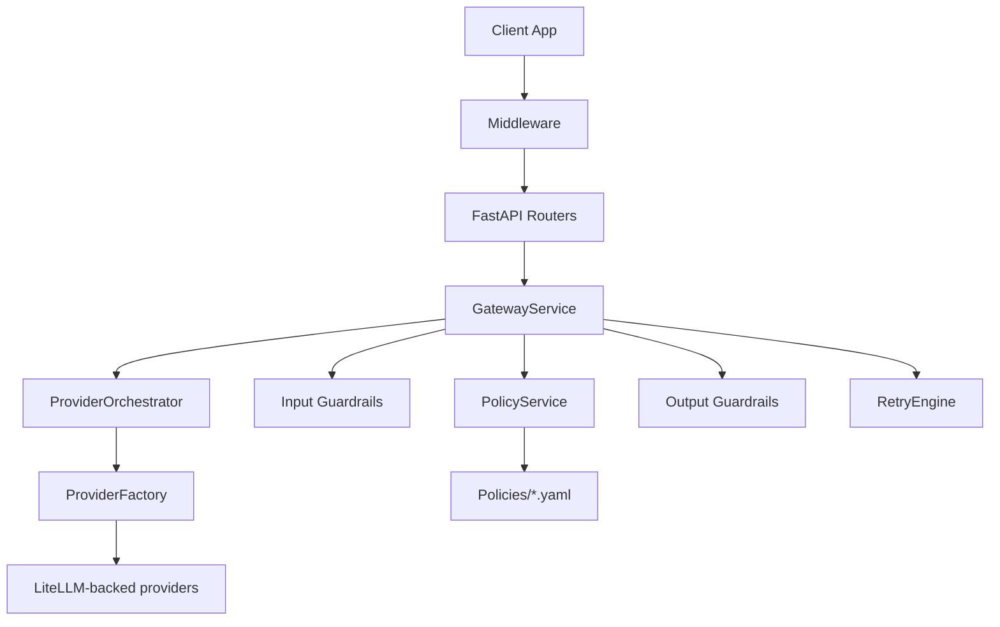
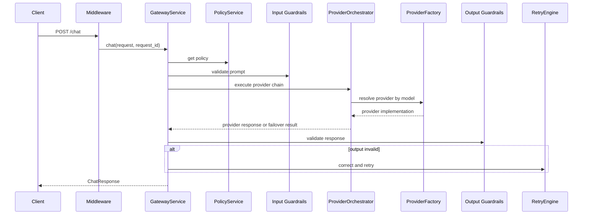

# Project Master Guide

## 1. Purpose of the project

LLM Guardrails Gateway is a FastAPI-based middleware service that sits between an application and one or more LLM providers. Its job is to enforce security, safety, and compliance controls before a prompt reaches a model and before a model response reaches a client.

The system is built around four core ideas:

- Policy-driven behavior through YAML files
- Layered validation with input and output guardrails
- Provider abstraction so model routing can change without rewriting business logic
- Observability through structured logs, request IDs, and response metadata

This project is intentionally modular: API concerns, business orchestration, domain guardrails, provider integration, and configuration are separated into distinct layers.

---

## 2. High-level architecture

### Runtime layers

- API layer: FastAPI routers and middleware
- Service layer: gateway orchestration, policy lookup, validation orchestration
- Guardrail layer: reusable validation components for input and output
- Provider layer: model routing and provider execution abstraction
- Policy layer: YAML parsing, validation, hot reload, and in-memory policy state

### Architecture summary



---

## 3. Repository map

### Core application

- app/main.py: application factory and router registration
- app/core/config.py: environment and runtime settings
- app/core/container.py: dependency injection wiring
- app/core/exceptions.py: domain exceptions and error codes
- app/core/logging.py: Loguru configuration and context propagation

### API layer

- app/api/middleware.py: request ID propagation, latency logging, error normalization
- app/api/dependencies.py: dependency helpers for container access
- app/api/routers/chat.py: chat endpoint
- app/api/routers/validation.py: standalone validation endpoints
- app/api/routers/policies.py: policy listing and reload endpoints
- app/api/routers/health.py: health endpoint

### Domain services

- app/services/gateway.py: end-to-end orchestration for chat requests
- app/services/validation.py: input guardrail execution
- app/services/output_validation.py: output guardrail execution
- app/services/policy.py: policy loading, caching, and hot reload

### Guardrails

- app/guardrails/base.py: base abstractions for guardrails and result models
- app/guardrails/result.py: normalized violation and validation-result objects
- app/guardrails/input/: prompt injection, jailbreak, PII, secrets, token length, language, toxicity
- app/guardrails/output/: JSON schema, toxicity, leakage, off-topic, hallucination

### Providers

- app/providers/base.py: common provider interface
- app/providers/factory.py: model-prefix to provider resolution
- app/providers/litellm_provider.py: LiteLLM adapter
- app/providers/models.py: normalized request/response models
- app/providers/provider_orchestrator.py: provider failover orchestration
- app/providers/strategies.py: provider ordering strategy abstraction

### Policies and schemas

- app/policies/models.py: typed policy schema, including provider config normalization
- app/policies/loader.py: YAML loader
- app/policies/hot_reload.py: filesystem watcher for live reload
- app/schemas/requests.py: request DTOs
- app/schemas/responses.py: response DTOs including fallback metadata

### Tests

- tests/unit/: unit coverage for policies, providers, guardrails, retry, and gateway
- tests/integration/: endpoint-level integration tests

---

## 4. Request lifecycle

A chat request follows this path:

1. The API receives a request through the chat router.
2. Middleware attaches or propagates a request ID and records latency.
3. GatewayService resolves the active policy.
4. Input guardrails are executed against the prompt.
5. If the prompt is allowed, the provider orchestrator attempts the configured provider chain.
6. Output guardrails evaluate the returned content.
7. If output validation fails and retries are allowed, the retry engine may correct the prompt and retry.
8. The gateway returns a ChatResponse with metadata about provider usage, retries, and fallback behavior.

### Sequence overview



---

## 5. Policy system

Policies are the central control plane for the gateway. They are stored as YAML files under policies/ and are loaded into memory when the service starts.

### Policy responsibilities

- Select the primary provider and fallback providers
- Choose provider ordering strategy
- Enable or disable input and output guardrails
- Set thresholds and actions for guardrails
- Configure retry behavior and fallback messages

### Example policy shape

```yaml
id: default
version: "1.0"
description: "Default policy"

provider:
  primary:
    name: openai
    model: gpt-4o
    timeout_seconds: 30
  fallbacks:
    - name: anthropic
      model: claude-3-5-sonnet-20241022
      timeout_seconds: 30
  strategy: sequential

input_guardrails:
  prompt_injection:
    enabled: true
    action: block
    threshold: 0.75

output_guardrails:
  toxicity:
    enabled: true
    action: block
    threshold: 0.85
```

### Important policy behavior

- The policy schema supports both legacy flat provider configuration and the newer nested provider structure for backward compatibility.
- The gateway uses a policy object as an immutable request-scoped value, so hot reload does not mutate in-flight request processing.
- The provider strategy is stored in the policy and passed into the orchestrator.

---

## 6. Provider orchestration and failover

The provider layer is designed to be resilient to temporary provider failures.

### ProviderOrchestrator

The orchestrator:

- accepts a provider factory and an ordered list of provider configurations
- tries providers in sequence
- returns the first successful response
- treats some failures as recoverable and proceeds to the next provider
- stops immediately for non-recoverable failures such as authentication problems

### Recoverable vs non-recoverable failures

Recoverable failures include errors that suggest a transient availability issue, such as:

- timeout
- rate limit
- quota exhaustion
- temporary network issue
- connection failures

Non-recoverable failures include issues such as:

- authentication failure
- permission or credential problems
- invalid configuration that will not succeed on retry

### Execution strategy

The current implementation uses a sequential strategy. The strategy abstraction is intentionally isolated so future strategies such as random selection or latency-aware selection can be added without changing the orchestrator contract.

### Provider metadata returned to clients

The response payload includes:

- fallback_used: whether a fallback provider was used
- attempts: how many providers were attempted
- provider_chain: the ordered list of providers used

This makes failover visible to callers and reduces the need for separate observability tooling in simple deployments.

---

## 7. Guardrails and validation design

The gateway separates validation into input and output concerns.

### Input guardrails

Input guardrails inspect the prompt before it reaches the model and can block or warn based on policy configuration.

Examples:

- Prompt injection detection
- Jailbreak detection
- PII detection
- Secret detection
- Token-length validation
- Language policy validation
- Toxicity detection

### Output guardrails

Output guardrails inspect the model response before it is returned to the client.

Examples:

- JSON schema validation
- Toxicity detection
- Prompt leakage detection
- Secret leakage detection
- Off-topic detection
- Hallucination checks

### Guardrail implementation pattern

Each guardrail follows a common interface:

- validate(content, context) → ValidationResult
- returns one or more violations when the content fails policy rules
- participates in risk scoring and policy enforcement without coupling to FastAPI

This makes guardrails easy to add and easy to test in isolation.

---

## 8. Retry and correction flow

If output validation fails, the system may trigger a retry loop.

### Retry behavior

- The retry engine uses a prompt correction step to reformulate the request
- It can re-run the provider call with corrected prompt context
- The retry count is bounded by policy configuration
- If retries are exhausted, the gateway returns a fallback response

### Retry policy configuration

The policy supports:

- max_attempts
- strategy selection
- fallback_message

This allows the gateway to degrade gracefully instead of failing hard in the face of output-policy violations.

---

## 9. Error handling and observability

The application uses a small domain-error model centered on GatewayError and its subclasses.

### Error categories

- input validation errors
- output validation errors
- policy errors
- provider errors
- retry exhaustion errors

### Logging

The project uses Loguru with:

- request IDs in log context
- structured fields for attempt number, provider, model, and latency
- console output configured centrally

This is especially useful for failover flows because each provider attempt can be traced independently.

### HTTP behavior

Middleware translates domain errors into consistent JSON responses with error codes, messages, and request IDs.

---

## 10. Development workflow

### Requirements

- Python 3.12+
- uv

### Setup

```bash
uv sync
cp .env.example .env
```

### Run the app

```bash
uv run uvicorn app.main:app --reload --host 0.0.0.0 --port 8000
```

### Run tests

```bash
pytest
```

### Useful endpoints

- /health
- /chat
- /validate/input
- /validate/output
- /policies
- /policies/reload

---

## 11. How to extend the system

### Add a new guardrail

1. Create a new guardrail class implementing the common guardrail interface.
2. Register it in the relevant validation service construction path.
3. Add the corresponding policy config entry in app/policies/models.py.
4. Add unit tests for success and failure cases.

### Add a new provider

1. Extend the provider factory mapping if the provider needs a new prefix or route.
2. Implement or adapt the provider interface in the provider layer.
3. Ensure the provider returns the normalized ProviderResponse model.
4. Add tests for provider resolution and execution.

### Add a new selection strategy

1. Implement a new strategy class in app/providers/strategies.py.
2. Register it in the strategy factory.
3. Wire it through policy configuration using the strategy name.

### Add a new policy field

1. Extend the schema in app/policies/models.py.
2. Update the default policy example in policies/default.yaml if needed.
3. Ensure any services that consume the field are updated accordingly.

---

## 12. Testing strategy

The repository uses pytest and focuses on behavior rather than implementation detail.

### Test categories

- Unit tests for guardrails, policies, provider adapters, and orchestrators
- Integration tests for API endpoints and end-to-end request flows
- Mock-based tests for external provider behavior so network calls are not required

### Testing principles

- Keep tests near the behavior they verify
- Prefer realistic data flows over brittle mocks
- Validate public contracts such as policy parsing, provider orchestration, and response metadata

---

## 13. Architectural defenses and interview talking points

If this project is being presented in a technical review or interview, the strongest points to emphasize are:

- Clear separation of concerns between HTTP, services, policies, guardrails, and providers
- Configurability through YAML rather than hard-coded behavior
- Backward compatibility in the policy schema for older configurations
- Explicit failover behavior for provider resilience
- A simple but extensible strategy pattern for provider ordering
- Strong observability around provider attempts and response outcomes

### Concise architecture defense

This service is designed as a policy-driven gateway rather than a one-off LLM wrapper. It can evolve in three directions without rewriting the core flow: more guardrails, more providers, or more sophisticated routing strategy.

### Common interview questions

- How does the gateway decide whether a request is safe? Through input guardrails and policy-driven thresholds.
- How are providers selected? Through a provider factory plus an ordering strategy configured per policy.
- What happens if a provider fails? The orchestrator attempts next configured providers when the error is recoverable.
- How are changes deployed without restart? Policy files can be hot-reloaded by the policy service.
- How is the system extended? New guardrails, providers, and strategies are added through isolated modules and registrations.

---

## 14. Operational notes

- The system is safest when providers and secrets are configured through environment variables and policy files rather than code.
- The default policy should be reviewed before production deployment so guardrail thresholds align with the intended risk profile.
- Failover behavior should be monitored through logs and response metadata, especially when multiple providers are configured.
- If a new provider is introduced, ensure that its failure modes are compatible with the orchestrator’s recoverable/non-recoverable classification.

---

## 15. Bottom line

The gateway is a policy-driven, provider-agnostic safety layer for LLM applications. Its design favors modularity, compatibility, testability, and graceful degradation over brittle single-provider coupling. That makes it suitable both as a production-grade middleware service and as a foundation for future AI safety and routing features.
