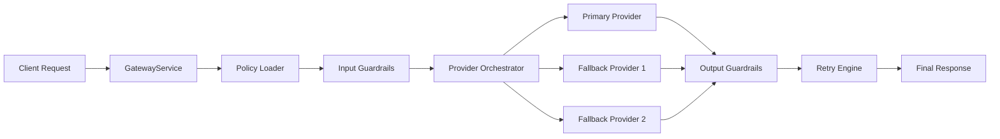

# LLM Guardrails Gateway

A provider-agnostic middleware service that enforces security, compliance, and response validation for Large Language Model APIs. Sits between your application and any LLM provider — OpenAI, DeepSeek, Gemini, Ollama — and applies configurable guardrails before requests reach the model and before responses reach the client.

## Features

- **Input guardrails** — prompt injection, jailbreak, PII, secrets, token length, language, toxicity
- **Output guardrails** — JSON schema, toxicity, prompt leakage, secret leakage, off-topic, hallucination
- **Policy engine** — YAML-driven rules with hot reload, no code changes required
- **Retry engine** — automatic corrected-prompt retry with configurable attempts and fallback
- **Provider abstraction** — swap LLM providers via config, not code (LiteLLM-backed)
- **Structured logging** — request ID, provider, risk score, latency, violations
- **97% test coverage** — unit + integration tests

---

## Quick Start

### Prerequisites

- Python 3.12+
- [uv](https://docs.astral.sh/uv/) package manager

### Local Development

```bash
# Clone and enter the project
git clone <repo-url>
cd llm-guardrails-gateway

# Install dependencies
uv sync

# Copy and configure environment
cp .env.example .env
# Edit .env with your API keys

# Run the server
uv run uvicorn app.main:app --reload --host 0.0.0.0 --port 8000
```

The API is now available at `http://localhost:8000`.
Interactive docs: `http://localhost:8000/docs`

### Docker

```bash
# Build and start
docker compose -f docker/docker-compose.yml up --build

# With local Ollama
docker compose -f docker/docker-compose.yml --profile ollama up --build
```

---

## API Reference

All endpoints accept and return `application/json`.

### POST /chat

Process a prompt through the full guardrails pipeline and return an LLM response.

**Request**
```json
{
  "prompt": "What is the capital of France?",
  "provider": "openai",
  "model": "gpt-4o",
  "policy_id": "default",
  "context": [
    {"role": "user", "content": "previous turn"},
    {"role": "assistant", "content": "previous response"}
  ]
}
```

**Response**
```json
{
  "request_id": "550e8400-e29b-41d4-a716-446655440000",
  "response": "Paris is the capital of France.",
  "provider": "openai",
  "model": "gpt-4o-2024-05-13",
  "risk_score": 0.0,
  "violations": [],
  "retries": 0,
  "latency_ms": 423.1,
  "input_valid": true,
  "output_valid": true
}
```

---

### POST /validate/input

Run input guardrails against a prompt without calling an LLM.

**Request**
```json
{
  "prompt": "My SSN is 123-45-6789",
  "policy_id": "default"
}
```

**Response**
```json
{
  "valid": false,
  "violations": [
    {
      "guardrail": "PIIDetector",
      "code": "pii_detected",
      "message": "PII detected: SSN",
      "severity": "high",
      "score": 1.0
    }
  ],
  "risk_score": 1.0
}
```

---

### POST /validate/output

Run output guardrails against an LLM response.

**Request**
```json
{
  "response": "Here is your API key: sk-abc123...",
  "prompt": "What is my API key?",
  "policy_id": "default"
}
```

**Response**
```json
{
  "valid": false,
  "violations": [
    {
      "guardrail": "SecretLeakageDetector",
      "code": "secret_leakage_detected",
      "message": "Secret detected in output",
      "severity": "critical",
      "score": 1.0
    }
  ],
  "risk_score": 1.0
}
```

You can also validate against an inline JSON schema:

```json
{
  "response": "{\"name\": \"Alice\"}",
  "expected_schema": {
    "type": "object",
    "required": ["name", "age"]
  }
}
```

---

### GET /health

Liveness probe.

```json
{
  "status": "ok",
  "version": "0.1.0",
  "policies_loaded": ["default"]
}
```

---

### GET /policies

List loaded policies and their active guardrails.

```json
{
  "policies": [
    {
      "id": "default",
      "version": "1.0",
      "provider": "openai/gpt-4o",
      "input_guardrails_enabled": ["PromptInjectionDetector", "PIIDetector"],
      "output_guardrails_enabled": ["OutputToxicityDetector", "SecretLeakageDetector"]
    }
  ]
}
```

---

### POST /policies/reload

Hot-reload policy files from disk without restarting the server.

```json
// Reload a specific policy
{ "policy_id": "default" }

// Reload all policies
{}
```

---

## Policy Configuration

Policies are YAML files in the `policies/` directory. The active policy is selected per-request via `policy_id` (defaults to `default`).

```yaml
# policies/strict.yaml
id: strict
version: "1.0"
description: "High-security policy for sensitive domains"

provider:
  name: openai
  model: gpt-4o
  timeout_seconds: 30

input_guardrails:
  prompt_injection:
    enabled: true
    threshold: 0.5     # lower = stricter
    action: block      # block | warn | log
  pii:
    enabled: true
    action: block
    entities: [EMAIL, PHONE, SSN, CREDIT_CARD]
  token_length:
    enabled: true
    max_tokens: 2048
    action: block

output_guardrails:
  json_schema:
    enabled: true
    schema_ref: schemas/response.json
  toxicity:
    enabled: true
    threshold: 0.6
    action: block
  secret_leakage:
    enabled: true
    action: block

retry:
  max_attempts: 3
  fallback_message: "This request cannot be processed safely."
```

Files are watched for changes and reloaded automatically. You can also trigger a reload via `POST /policies/reload`.

---

## Multi-Provider Failover

The gateway can route requests across multiple providers in a controlled and observable manner. Provider orchestration is driven by policy configuration and executed through a dedicated strategy layer, allowing the gateway to select the provider order without changing application code.

### Provider orchestration

Each request is evaluated against the active policy and then dispatched through the configured provider chain. The current implementation supports a sequential strategy, which tries providers in the order defined by policy. This design keeps the orchestration flow simple while remaining extensible for future strategies such as random, lowest-latency, or cheapest selection.

### Automatic failover

If a provider returns a recoverable error such as a timeout, rate limit, quota issue, or transient network failure, the gateway automatically advances to the next configured provider. Non-recoverable errors, such as authentication failures, stop the flow immediately and surface an error to the caller.

### YAML configuration

Provider failover is configured directly in policy YAML. The `provider` block now supports a `strategy` field plus `primary` and `fallbacks` entries. The default behavior is `sequential`, which preserves backward compatibility while enabling failover chains.

### Retry behaviour

The gateway retains the existing retry pipeline for output validation. When a provider call fails before a response is produced, the orchestrator may move to the next provider. If response validation later fails, the retry engine can continue using the configured retry policy and fallback messaging.

### Architecture diagram



### Example API response

When failover is used, the response includes metadata that makes the execution path observable:

```json
{
  "request_id": "550e8400-e29b-41d4-a716-446655440000",
  "response": "Fallback response",
  "provider": "gemini",
  "model": "gemini-2.5-flash",
  "risk_score": 0.0,
  "violations": [],
  "retries": 0,
  "fallback_used": true,
  "attempts": 2,
  "provider_chain": ["openai", "gemini"],
  "latency_ms": 412.3,
  "input_valid": true,
  "output_valid": true
}
```

### Example policy configuration

```yaml
id: multi-provider
version: "1.0"
description: "Sequential failover policy for production workloads"

provider:
  strategy: sequential
  primary:
    name: openai
    model: gpt-4o-mini
    timeout_seconds: 30
  fallbacks:
    - name: gemini
      model: gemini-2.5-flash
      timeout_seconds: 30
    - name: deepseek
      model: deepseek-chat
      timeout_seconds: 30

input_guardrails:
  prompt_injection:
    enabled: true
    action: block

output_guardrails:
  toxicity:
    enabled: true
    threshold: 0.85
    action: block

retry:
  max_attempts: 3
  strategy: correct_and_retry
  fallback_message: "I’m unable to process this request safely."
```

---

## Environment Variables

| Variable | Default | Description |
|---|---|---|
| `APP_NAME` | `LLM Guardrails Gateway` | Application name in logs |
| `APP_VERSION` | `0.1.0` | Version string |
| `DEBUG` | `false` | Enable debug mode |
| `LOG_LEVEL` | `INFO` | Logging level |
| `HOST` | `0.0.0.0` | Bind host |
| `PORT` | `8000` | Bind port |
| `POLICY_DIR` | `policies` | Path to policy YAML files |
| `DEFAULT_POLICY_ID` | `default` | Fallback policy when none specified |
| `OPENAI_API_KEY` | — | OpenAI API key |
| `DEEPSEEK_API_KEY` | — | DeepSeek API key |
| `GOOGLE_API_KEY` | — | Google Gemini API key |
| `OLLAMA_BASE_URL` | `http://localhost:11434` | Ollama base URL |

---

## Request Headers

| Header | Description |
|---|---|
| `X-Request-ID` | Optional. If provided, echoed in response and logs. Auto-generated if absent. |

---

## Running Tests

```bash
# All tests with coverage
uv run pytest

# Integration tests only
uv run pytest tests/integration/

# Unit tests only
uv run pytest tests/unit/

# With verbose output
uv run pytest -v
```

---

## Linting & Type Checking

```bash
# Lint
uv run ruff check .

# Format
uv run black .

# Type check
uv run mypy app/
```

---

## Project Structure

```
llm-guardrails-gateway/
├── app/
│   ├── api/
│   │   ├── routers/          # FastAPI route handlers
│   │   ├── middleware.py     # Error handling, request context
│   │   └── dependencies.py  # FastAPI Depends() providers
│   ├── core/
│   │   ├── config.py         # Pydantic settings
│   │   ├── container.py      # Dependency injection container
│   │   ├── exceptions.py     # Domain exceptions
│   │   └── logging.py        # Loguru setup
│   ├── guardrails/
│   │   ├── input/            # Input guardrail implementations
│   │   └── output/           # Output guardrail implementations
│   ├── policies/
│   │   ├── loader.py         # YAML policy loader
│   │   ├── models.py         # Policy Pydantic models
│   │   └── hot_reload.py     # File watcher for live reload
│   ├── providers/
│   │   ├── base.py           # AbstractLLMProvider interface
│   │   ├── litellm_provider.py
│   │   └── factory.py        # Provider factory
│   ├── retry/
│   │   ├── engine.py         # Retry orchestration loop
│   │   └── prompt_corrector.py
│   ├── services/
│   │   ├── gateway.py        # Full request lifecycle
│   │   ├── validation.py     # Input validation service
│   │   ├── output_validation.py
│   │   └── policy.py         # Policy CRUD + reload
│   └── main.py               # FastAPI app factory
├── policies/
│   └── default.yaml
├── tests/
│   ├── integration/          # HTTP-level tests
│   └── unit/                 # Component-level tests
├── docker/
│   ├── Dockerfile
│   └── docker-compose.yml
├── .env.example
└── pyproject.toml
```

---

## Architecture

See [docs/architecture.md](docs/architecture.md) for sequence and component diagrams.

---

## License

MIT
