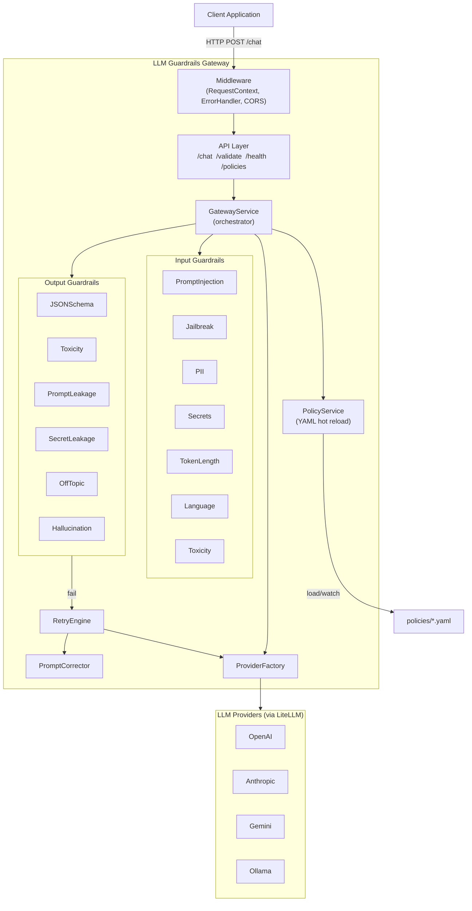
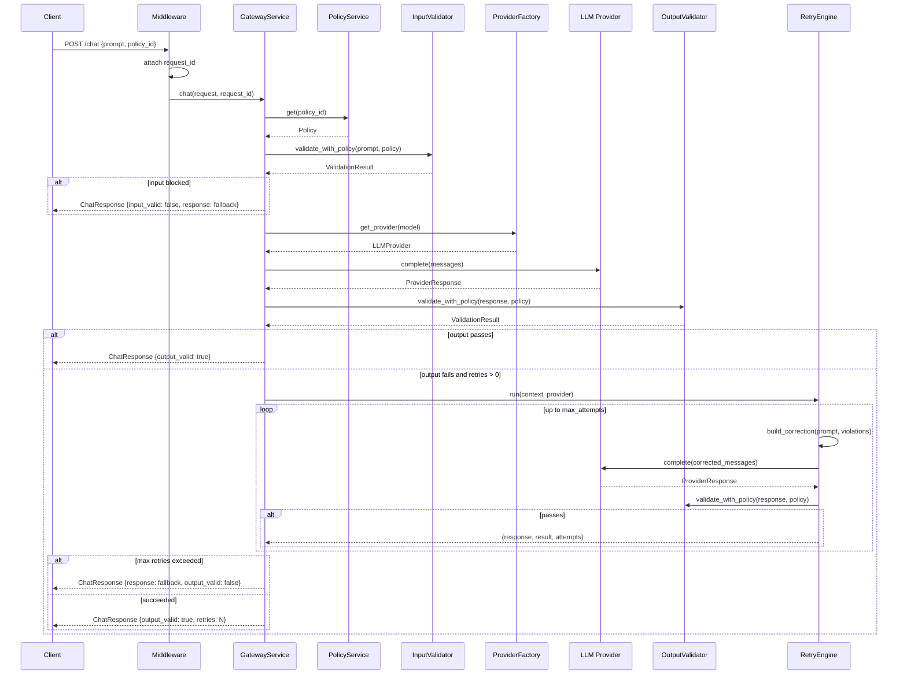
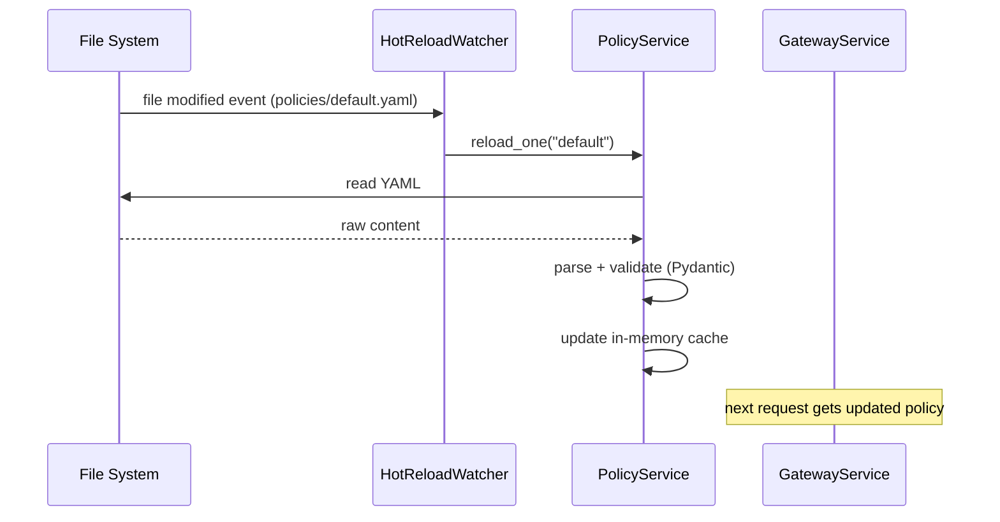

# Architecture

## Component Diagram

---

## Sequence Diagram — /chat Request

---

## Sequence Diagram — Policy Hot Reload

---

## Design Decisions

**Clean Architecture layers**
- `app/api` — HTTP concerns only (routing, serialisation, auth)
- `app/services` — orchestration and use cases
- `app/guardrails` — pure validation logic, no FastAPI imports
- `app/providers` — external provider abstraction
- `app/policies` — configuration loading and watching

**Strategy pattern for guardrails**
Every guardrail implements `BaseGuardrail.check(text, context) → ValidationResult`. Adding a new guardrail is adding one file; no changes to the calling service.

**Factory pattern for providers**
`ProviderFactory.get_provider(model_string)` returns an `AbstractLLMProvider`. LiteLLM resolves the actual API from the model prefix (`openai/`, `anthropic/`, etc.), so adding a new provider requires zero new code.

**Dependency injection container**
A single `Container` object is constructed at startup and shared across all requests via `get_container()`. This makes unit testing trivial — tests construct the services directly with mocks.

**Immutable policy per request**
`GatewayService` calls `policy_service.get()` at the start of each request. The returned `Policy` is a Pydantic model (immutable value object). Hot reload only updates the registry; in-flight requests are unaffected.
